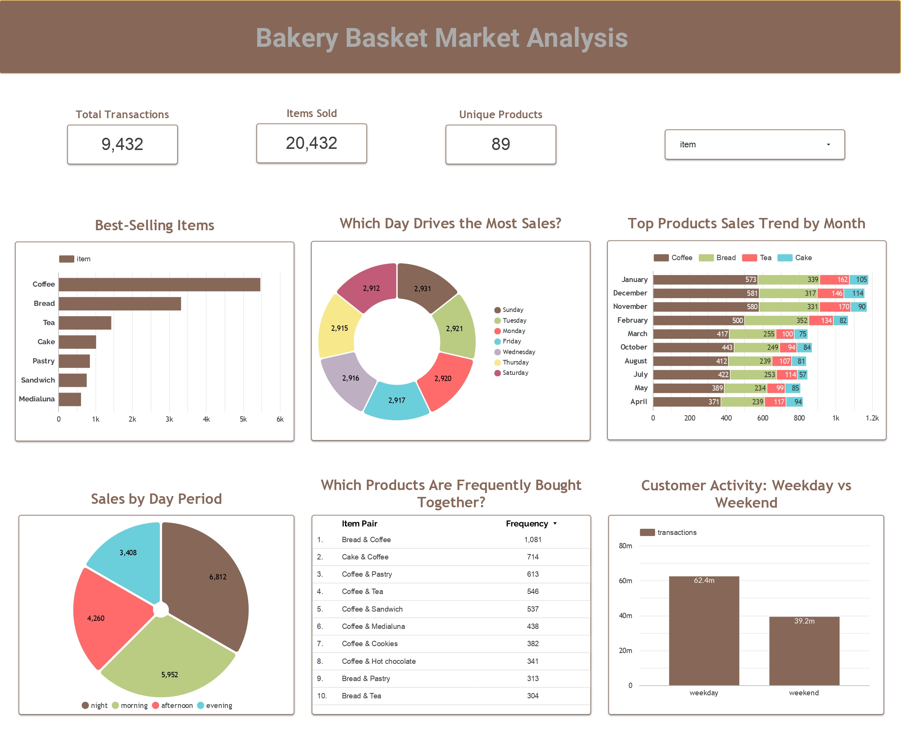

# Bakery Market Basket Analysis Using SQL and Interactive Dashboard
This is Data Analyst project explores bakery customer purchase patterns using SQL and an interactive dashboard. It applies Market Basket Analysis to identify frequent item combinations and generate insights for product bundling, cross-selling, and data-driven business decisions.

 
 

## 1. Problem Statement
Dalam bisnis bakery, memahami pola pembelian pelanggan merupakan hal penting untuk meningkatkan penjualan dan efektivitas strategi pemasaran. Namun, seringkali data transaksi hanya digunakan sebagai catatan penjualan tanpa dianalisis lebih lanjut.

Permasalahan utama dalam project ini adalah bagaimana mengidentifikasi produk yang sering dibeli secara bersamaan oleh pelanggan, serta memahami pola kombinasi pembelian tersebut. Tanpa analisis yang tepat, bisnis akan kesulitan dalam menentukan strategi seperti bundling produk, penempatan barang, dan cross-selling.

Oleh karena itu, diperlukan analisis Market Basket untuk menggali hubungan antar produk berdasarkan data transaksi, sehingga dapat menghasilkan insight yang mendukung pengambilan keputusan bisnis berbasis data.

## 2. Tujuan
Tujuan dari analisis ini adalah:

- Mengidentifikasi produk yang paling sering dibeli oleh pelanggan
- Menemukan kombinasi produk (item pair) yang sering dibeli secara bersamaan
- Mengukur kekuatan hubungan antar produk menggunakan metrik seperti frequency dan support
- Menganalisis pola pembelian berdasarkan waktu (hari, periode, weekday vs weekend)
- Menghasilkan insight yang dapat digunakan untuk strategi product bundling dan cross-selling
- Menyajikan hasil analisis dalam bentuk dashboard agar mudah dipahami oleh stakeholder

## 3. Dataset
Adapun kolom-kolom yang terdapat dalam dataset meliputi:

- Transaction → ID unik untuk setiap transaksi pembelian
- Item → nama produk yang dibeli dalam transaksi
- Datetime → waktu terjadinya transaksi
- Period Day → kategori waktu dalam sehari berdasarkan jam transaksi (morning, afternoon, evening, night)
- Weekday/Weekend → klasifikasi hari transaksi menjadi hari kerja (weekday) atau akhir pekan (weekend)

## 4. Tools
- SQL (MySQL) → data processing & analysis
- Looker Studio → dashboard
- Microsoft Excel

## 5. Data Analysis Process
Pada project ini, proses analisis data dilakukan menggunakan SQL untuk mengolah data transaksi menjadi insight yang dapat digunakan dalam Market Basket Analysis. Tahapan analisis yang dilakukan meliputi:

### 1. Data Cleaning & Feature Engineering

Tahap awal dilakukan transformasi dan validasi data untuk memastikan konsistensi informasi waktu pada dataset.

Meskipun dataset awal sudah memiliki kolom period_day, ditemukan bahwa beberapa nilai pada kolom tersebut tidak sesuai dengan jam pada kolom datetime. Oleh karena itu, dilakukan proses pembuatan ulang kolom period_day menggunakan logika berbasis waktu agar lebih akurat.

Proses yang dilakukan meliputi:

- Ekstraksi date, time, month, dan day dari kolom datetime
- Pembuatan ulang kolom period_day menggunakan CASE WHEN berdasarkan jam:
  - Morning (05.00 – 11.00)
  - Afternoon (12.00 – 16.00)
  - Evening (17.00 – 20.00)
  - Night (di luar jam tersebut)

### 2. Data Exploration

Melakukan eksplorasi data untuk memahami gambaran umum dataset:

- Menghitung total transaksi unik
- Menghitung jumlah item unik yang dijual

Hal ini bertujuan untuk memahami skala data sebelum dilakukan analisis lebih lanjut.

### 3. Sales Analysis

Menganalisis pola penjualan berdasarkan waktu dan produk:

- Penjualan berdasarkan period day (morning, afternoon, evening, night)
- Penjualan berdasarkan weekday vs weekend
- Identifikasi top-selling items

Analisis ini membantu memahami kapan dan produk apa yang paling banyak dibeli pelanggan.

### 4. Product Performance Analysis

Menganalisis performa produk berdasarkan waktu pembelian:

- Produk terlaris pada weekday
- Produk terlaris pada weekend

Hal ini bertujuan untuk melihat perbedaan preferensi pelanggan berdasarkan waktu.

### 5. Market Basket Analysis (Item Association)

Tahap utama dalam project ini adalah melakukan Market Basket Analysis untuk menemukan hubungan antar produk.

Metode yang digunakan:

- Self Join pada tabel transaksi untuk menggabungkan item dalam transaksi yang sama
- Menghasilkan kombinasi pasangan produk (item pair)
Menghitung:
- Frequency → seberapa sering dua produk dibeli bersama
- Support → proporsi transaksi yang mengandung pasangan produk tersebut

Analisis ini digunakan untuk mengidentifikasi produk yang sering dibeli bersamaan oleh pelanggan.

## 6. Key Analysis
### 1. Performa Produk (Popularitas Item)
- Coffee mendominasi penjualan dengan total 5.471 unit, jauh di atas produk lainnya.
- Top 5 item teratas: Coffee (5.471), Bread (3.325), Tea (1.435), Cake (1.025), Pastry (856).
- Minuman hangat lain seperti Tea dan Hot Chocolate termasuk dalam 10 besar, menandakan permintaan tinggi di kategori minuman.

### 2. Market Basket Analysis (Pola Pembelian Pasangan)
- Kombinasi paling populer: Bread & Coffee (support 0.1146), artinya ~11,5% transaksi mengandung kedua item.
- Pasangan Cake & Coffee (0.0757) dan Coffee & Pastry (0.0650) juga signifikan.
- Indikasi kuat pelanggan mencari makanan manis untuk menemani kopi.

### 3. Analisis Waktu Penjualan (Period Day)
- Penjualan tertinggi di Night (6.812 unit), disusul Morning (5.952 unit).
- Penjualan terendah ada di Evening (3.408 unit).
- Pola menunjukkan peak hours utama: sore ke malam.

### 4. Perbandingan Weekday vs Weekend
- Total volume lebih tinggi di Weekday (12.767) dibanding Weekend (7.665).
- Rata-rata per hari, Weekend lebih padat.
- Coffee & Bread tetap konsisten sebagai top item, sementara item seperti Medialuna, Hot Chocolate, dan Scone naik saat Weekend.

## 7. Business Recomendation
### 1. Strategi Menu Bundling
- Buat paket populer untuk meningkatkan nilai transaksi:
  - Breakfast Set: Bread + Coffee
  - Afternoon Treat: Cake + Coffee atau Coffee + Pastry
Bisa ditawarkan dengan harga sedikit lebih murah dibanding membeli satuan.
### 2. Promosi Berdasarkan Waktu
- Fokus promosi pada waktu Afternoon & Evening untuk mendorong penjualan item unggulan.
- Perkenalkan Happy Hour atau diskon khusus di Evening untuk meningkatkan penjualan saat jam sepi.

### 3. Pengelolaan Stok dan Inventaris
- Sesuaikan stok dengan pola penjualan: lebih banyak Coffee, Bread, dan Cake di pagi & siang.
- Kurangi stok untuk item yang jarang terjual di sore hari atau tawarkan dalam bentuk paket promo.

### 4. Upselling & Cross-Selling
- Tambahkan rekomendasi item saat pembelian untuk mendorong pembelian tambahan

Contoh: “Mau sekalian coba cakenya kak buat nemenin ngopi enak lho?”
- Tampilkan paket bundling di kasir atau di platform online untuk mendorong penjualan tambahan.

### 5. Pengembangan Produk di Weekend
- Tawarkan variasi menu yang lebih santai dan premium di akhir pekan, seperti Hot Chocolate, Scone, atau Medialuna.
- Bisa ditambahkan menu seasonal atau limited edition untuk meningkatkan ketertarikan pelanggan.

## 8. Dashboard
https://lookerstudio.google.com/reporting/e2f2269d-a579-4a31-9ead-11e8b69c74a8

